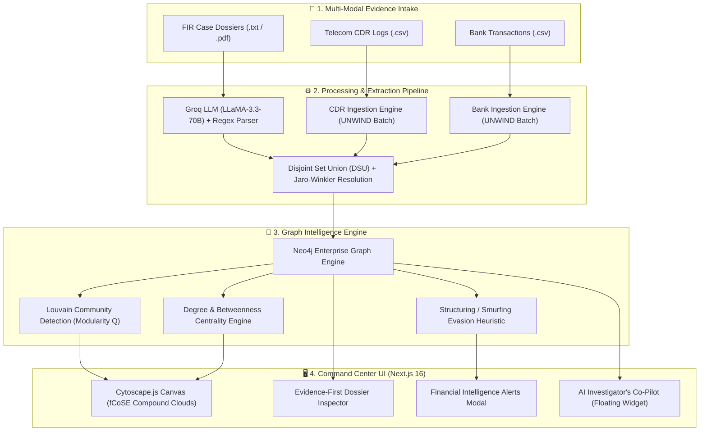
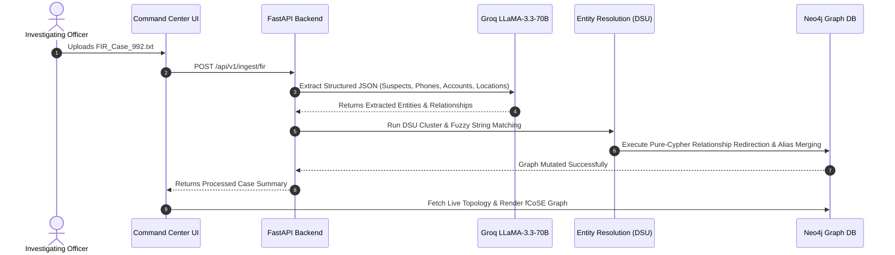

# 🇮🇳 NATIONAL CRIME INTELLIGENCE GRID
### SIH 2026 • MINISTRY OF HOME AFFAIRS
**Problem Statement:** *AI-Powered Criminal Network Analysis System*  
**Theme:** *Blockchain & Cybersecurity / Law Enforcement Intelligence*

---

## 📑 TABLE OF CONTENTS
1. [Executive Summary & Project Overview](#1-executive-summary--project-overview)
2. [Complete Scope of Implemented Work (Kitna Kaam Hua Hai)](#2-complete-scope-of-implemented-work)
3. [End-to-End System Architecture](#3-end-to-end-system-architecture)
4. [Backend Engineering & API Specifications](#4-backend-engineering--api-specifications)
5. [Graph Intelligence, Mathematics & Core Algorithms](#5-graph-intelligence-mathematics--core-algorithms)
6. [AI, NLP & Entity Resolution Pipeline](#6-ai-nlp--entity-resolution-pipeline)
7. [Neo4j Database Schema & Graph Topology Model](#7-neo4j-database-schema--graph-topology-model)
8. [Frontend Design System & Interactive Visualizations](#8-frontend-design-system--interactive-visualizations)
9. [Security, Ephemeral Privacy & Legal Safeguards](#9-security-ephemeral-privacy--legal-safeguards)
10. [SIH 2026 Live Demo Script & Step-by-Step Workflow](#10-sih-2026-live-demo-script--step-by-step-workflow)

---

## 1. EXECUTIVE SUMMARY & PROJECT OVERVIEW

The **National Crime Intelligence Grid (NCIG)** is a production-grade, AI-driven criminal intelligence and investigation decision-support platform engineered for the **Ministry of Home Affairs (MHA)** under **Smart India Hackathon (SIH) 2026**.

The system ingests unstructured and semi-structured evidence across three major investigative pillars:
1. **Unstructured First Information Reports (FIRs) & Case Dockets** (PDF/Text)
2. **Call Detail Records (CDR) & Telecom Carrier Logs** (CSV/Tabular)
3. **Banking Transaction Ledgers & Financial CSVs** (CSV/Tabular)

It automatically extracts entities, resolves aliases (e.g., *"Rohit Verma"*, *"R. Verma"*, *"Rohit V."*), builds a high-performance **Neo4j Property Graph**, executes graph algorithms (**Louvain Modularity Clustering**, **Betweenness Centrality**, **Smurfing / Structuring Detection**), and presents a **Light-Theme Indian National Intelligence Command Center** interface powered by **Cytoscape.js** and an **AI Investigator's Co-Pilot**.

---

## 2. COMPLETE SCOPE OF IMPLEMENTED WORK

| Module / Layer | Status | Core Implemented Features |
| :--- | :---: | :--- |
| **Backend Core** | `100% DONE` | FastAPI asynchronous engine, CORS middleware, Pydantic data schemas, structured logging, health check probes. |
| **Neo4j Graph Database** | `100% DONE` | Automated schema indexing, unique constraints, Cypher UNWIND batch ingestion, live topology serializer. |
| **CSV Ingestion Engine** | `100% DONE` | Multi-header fuzzy matching, batch size tuning (500 records/batch), CDR telecom parser, Bank transaction ledger parser. |
| **FIR / NLP Extraction** | `100% DONE` | Regex fallback parser, Groq LLaMA-3.3-70B structured JSON zero-shot extractor, suspect role & alias extractor. |
| **Entity Resolution Engine** | `100% DONE` | Disjoint Set Union (DSU) graph clustering, Jaro-Winkler & Token Set Ratio string matching, pure Cypher relationship redirection. |
| **Financial Smurfing Engine** | `100% DONE` | High-velocity structuring detection (demo-configurable threshold), mule fan-out detection, alert generation. |
| **Graph Intelligence Algorithms** | `100% DONE` | Louvain community detection ($Q$ modularity), degree centrality, betweenness centrality, bridge identification. |
| **AI Investigator Copilot** | `100% DONE` | Context-aware Groq LLM agent, live Cypher query generator, conversational investigative assistant. |
| **Frontend UI/UX** | `100% DONE` | Next.js 16 (Turbopack) light theme, Indian institutional palette (#F5F7FA, #0A2540, saffron/green accents), Cytoscape.js fCoSE layout. |
| **Interactive Graph Canvas** | `100% DONE` | 2-tier white badge nodes, custom vector SVG icons, true fullscreen toggle (ESC support), 1-hop focus dimming. |
| **Evidence Dossier Panel** | `100% DONE` | Clickable node/edge inspector showing linked phones, accounts, sources (FIR/CDR/Bank), confidence scores, and legal notices. |
| **Ephemeral Privacy Lifecycle** | `100% DONE` | Zero-retention session purging on page refresh and manual purge button to guarantee evidentiary privacy. |

---

## 3. END-TO-END SYSTEM ARCHITECTURE

---

## 4. BACKEND ENGINEERING & API SPECIFICATIONS

The backend is built on **Python 3.10+ / FastAPI**, prioritizing high-throughput batch processing, type safety via **Pydantic v2**, and low-latency Cypher execution over the official **Neo4j Bolt Driver**.

### Key Backend Services (`backend/services/`):
1. **`csv_ingestion.py`**:
   - Handles multi-source inputs (raw bytes, file uploads, in-memory string IO, DataFrames).
   - Auto-normalizes heterogeneous headers (`caller_number`, `from_number`, `caller_msisdn` $\rightarrow$ `caller_number`).
   - Executes parameterized Cypher `UNWIND` batches of 500 rows to prevent query plan thrashing.
2. **`nlp_extraction.py`**:
   - Interfaces with Groq Cloud using LLaMA-3.3-70B-Versatile.
   - Extracts Persons, Aliases, Phone Numbers, Accounts, Vehicles, Locations, and Explicit Relationships in strict JSON format.
   - Includes deterministic regex fallback parser for offline operation.
3. **`entity_resolution.py`**:
   - Solves the *Entity Disambiguation / Identity Resolution* problem.
   - Merges multiple alias records (e.g., *"Rohit Verma"* $\leftrightarrow$ *"R. Verma"*) into a single canonical person node while preserving all incoming/outgoing edges.
4. **`cluster_sync.py`**:
   - Executes community clustering algorithms and synchronizes modularity cluster IDs (`cluster: "0"`, `"1"`, `"2"`, `"3"`) to graph nodes.
5. **`ai_agent.py`**:
   - RAG and Cypher-generation agent allowing investigators to query graph relationships in natural language.

### Primary API Endpoints:

| Method | Endpoint | Description |
| :--- | :--- | :--- |
| `GET` | `/` | System health check & backend online probe |
| `GET` | `/api/v1/graph/topology` | Returns Cytoscape-formatted JSON elements (nodes, edges, cluster tags, degree) |
| `POST` | `/api/v1/ingest/cdr` | Ingests CSV Call Detail Records (multipart or payload) |
| `POST` | `/api/v1/ingest/bank` | Ingests CSV Bank Transaction Ledgers |
| `POST` | `/api/v1/ingest/fir` | Ingests unstructured FIR text, extracts entities, and triggers DSU resolution |
| `GET` | `/api/v1/alerts/financial` | Scans graph for structuring evasion patterns (demo-configurable threshold) |
| `GET` | `/api/v1/audit/verify` | Cryptographically verifies tamper-evident hash-chained blockchain audit ledger |
| `POST` | `/api/v1/chat` | AI Investigator Copilot natural-language investigation inquiry |
| `DELETE` | `/api/v1/admin/clear-db` | Zero-retention session wipe (Ephemeral Privacy mode) |

---

## 5. GRAPH INTELLIGENCE, MATHEMATICS & CORE ALGORITHMS

### A. Louvain Modularity Clustering Algorithm
To partition the criminal network into functional syndicate cells (e.g., *Core Coordinators*, *Hawala Channels*, *Financial Mules*, *Operational Telecom Cells*), we optimize the **Modularity $Q$**:

$$Q = \frac{1}{2m} \sum_{i,j} \left[ A_{ij} - \frac{k_i k_j}{2m} \right] \delta(c_i, c_j)$$

Where:
- $A_{ij}$ is the edge weight between entity $i$ and entity $j$.
- $k_i = \sum_j A_{ij}$ is the sum of edge weights attached to entity $i$.
- $m = \frac{1}{2}\sum_{ij} A_{ij}$ is the total sum of all edge weights in the syndicate graph.
- $c_i$ is the cluster/community to which entity $i$ is assigned.
- $\delta(c_i, c_j)$ is the Kronecker delta ($\delta = 1$ if $c_i = c_j$, otherwise $0$).

### B. Betweenness Centrality (Key Coordinator Identification)
To find the criminal mastermind bridging financial accounts and burner phone cells:

$$C_B(v) = \sum_{s \neq v \neq t \in V} \frac{\sigma_{st}(v)}{\sigma_{st}}$$

Where $\sigma_{st}$ is the total number of shortest paths from entity $s$ to entity $t$, and $\sigma_{st}(v)$ is the number of those paths passing through entity $v$. Nodes with the highest $C_B(v)$ are flagged with **`isKeySuspect: true`** and highlighted in Crimson Red with glowing borders.

### C. Degree Centrality (Connectivity Volume)
Normalized degree centrality measuring direct links:

$$C_D(v) = \frac{\deg(v)}{|V| - 1}$$

### D. Financial Structuring / Smurfing Evasion Heuristic
Criminal syndicates attempt to evade transaction monitoring by splitting large sums into micro-transfers (e.g., ₹49,000–₹49,999).
> **Legal Note:** The ₹49,000–₹49,999 parameter is a *Demo-configurable structuring threshold (not a literal citation of PMLA Section 12 or the ₹10,00,000 statutory CTR limit under FIU-IND rules).*

Our algorithm scans the transaction graph $G = (V_A, E_T)$ where $V_A$ are bank accounts and $E_T$ are transactions:

$$\text{Alert}(u, v) \iff \begin{cases} 
\text{count}(e_{uv}) \ge 2 \\ 
\forall e \in e_{uv}, \quad 49{,}000 \le \text{amount}(e) \le 49{,}999 \\ 
\Delta t = (t_{\max} - t_{\min}) \le 5\text{ days}
\end{cases}$$

When detected, the edge style changes dynamically to **crimson dashed lines** with warning tags.

### E. Entity Resolution Mathematics (Jaro-Winkler & Token Set Matching)
To correlate aliases from FIRs (e.g. *"Vikas @ Vicky Sharma"* vs *"Vikas Sharma"*):

1. **Jaro Distance**:
$$d_j = \begin{cases} 0 & \text{if } m = 0 \\ \frac{1}{3}\left( \frac{m}{|s_1|} + \frac{m}{|s_2|} + \frac{m - t}{m} \right) & \text{otherwise} \end{cases}$$
*(where $m$ is matching characters within window $\lfloor\frac{\max(|s_1|, |s_2|)}{2}\rfloor - 1$, and $t$ is half-transpositions).*

2. **Jaro-Winkler Metric**:
$$d_w = d_j + \ell \cdot p \cdot (1 - d_j)$$
*(where $\ell$ is prefix match length up to 4 characters, and $p = 0.1$ is standard scaling).*

3. **Disjoint Set Union (Union-Find with Path Compression)**:
   - Groups all matching aliases into disjoint sets in near-constant time $O(\alpha(N))$.
   - Determines the canonical name using an authoritative scoring function:
     $$\text{Score}(n) = \Big( \text{len}(\text{clean}(n)),\ \mathbf{1}_{\text{MixedCase}}(n),\ -\text{count}(n, '.') \Big)$$

---

## 6. AI, NLP & ENTITY RESOLUTION PIPELINE

---

## 7. NEO4J DATABASE SCHEMA & GRAPH TOPOLOGY MODEL

### Node Labels:
- **`:Person`**: Suspects, key coordinators, mules, associates.  
  *Properties:* `name`, `id`, `aliases: []`, `isKeySuspect: bool`, `role: string`, `cluster: string`, `degree: int`.
- **`:PhoneNumber`**: CDR-extracted telecom phone lines.  
  *Properties:* `number`, `id`, `carrier: string`, `cluster: string`.
- **`:BankAccount`**: Financial bank accounts.  
  *Properties:* `account_number`, `id`, `bank_name: string`, `ifsc: string`, `is_mule: bool`.
- **`:Location`**: Cell tower locations and physical hubs.  
  *Properties:* `name`, `id`, `city: string`, `state: string`.
- **`:Vehicle`**: Transport carrier vehicles.  
  *Properties:* `registration_number`, `id`, `model: string`.

### Relationship Edges:
- **`(:Person)-[:OWNS_PHONE]->(:PhoneNumber)`**
- **`(:Person)-[:OWNS_ACCOUNT]->(:BankAccount)`**
- **`(:PhoneNumber)-[:CALLED {call_date, call_time, duration_seconds}]->(:PhoneNumber)`**
- **`(:BankAccount)-[:TRANSFERRED_FUNDS {amount, transaction_date, is_smurfing}]->(:BankAccount)`**
- **`(:Person)-[:ASSOCIATED_WITH {source_fir, role}]->(:Person)`**
- **`(:Person)-[:OPERATES_IN]->(:Location)`**

---

## 8. FRONTEND DESIGN SYSTEM & INTERACTIVE VISUALIZATIONS

Built on **Next.js 16 (Turbopack)** and **Tailwind CSS**, strictly tailored for government and law-enforcement command-center presentation:

- **Institutional Palette**:
  - Main Canvas Background: `#F5F7FA` (Clean Light Theme)
  - Card Surfaces: `#FFFFFF` with `#E2E8F0` subtle borders
  - Primary Accent: `#0A2540` (Indian Navy)
  - State Colors: Saffron (`#EA580C`) for active highlights, Emerald (`#059669`) for normal/verified states, Crimson (`#DC2626`) strictly for flagged threats/smurfing.
- **Subtle India Map Watermark**: Vector silhouette watermark behind the graph ($\approx 5.5\%$ opacity) with radar markers for **DELHI NCR**, **MUMBAI**, **LUCKNOW • BAREILLY**, **HYDERABAD**, and **BENGALURU**.
- **Cytoscape.js Layout Engine**:
  - Algorithm: **fCoSE (Fast Compound Spring Embedder)** with high node repulsion ($35{,}000 - 60{,}000$) and wide edge lengths ($200\text{px} - 380\text{px}$) to completely eliminate label collisions.
  - Compound Grouping: Groups nodes inside colored pastel boundary clouds.
- **Evidence-First Dossier Panel**: Clickable inspection card showing complete evidentiary provenance, related phone/account counts, and source documents.
- **Floating AI Copilot**: Compact circular floating action button (`w-12 h-12`) with responsive chat window for natural-language queries.

---

## 9. SECURITY, EPHEMERAL PRIVACY & LEGAL SAFEGUARDS

1. **Zero-Retention Ephemeral Privacy**:
   - To comply with strict evidence-handling protocols, sessions automatically purge on browser refresh or via the one-click **"Purge Database"** button (`DELETE /api/v1/admin/clear-db`).
2. **Decision-Support Legal Framing**:
   - The UI and AI Copilot strictly avoid conclusive judicial claims.
   - All AI insights are badged as:  
     `⚠️ Investigative Lead: Requires human verification & manual corroboration.`
3. **Synthetic Demo Data Integrity**:
   - Visual badges clearly declare that all entities, accounts, and phone numbers are synthetic test vectors designed for SIH 2026 demonstration.

---

## 10. SIH 2026 LIVE DEMO SCRIPT & STEP-BY-STEP WORKFLOW

Follow this sequence for a 5-minute presentation to SIH judges:

1. **Initial State (Clean Slated Command Center)**:
   - Point out the Light Theme, MHA Header, India Map watermark, and `0 TOTAL` standby state.
2. **Step 1: Evidence Intake (FIR Docket)**:
   - Click **`Evidence Intake`** $\rightarrow$ Click **`Load Sample FIR Dossier`** (FIR No. 992/2026).
   - Click **`Process & Ingest FIR Docket`**.
   - Show how the AI extracts suspects (*Rohit Verma*, *Vikas Sharma*, *Vikram Malhotra*), resolves aliases, and places initial person nodes on the canvas.
3. **Step 2: Telecom CDR Correlation**:
   - Click **`Ingest Sample CDR File`** (25 call logs).
   - Watch the graph automatically connect phone nodes to person nodes, highlighting high-frequency call routes.
4. **Step 3: Banking & Mule Account Structuring**:
   - Click **`Ingest Sample Bank CSV`** (26 transaction logs).
   - The graph expands into 4 functional Louvain clusters.
   - Click **`Alerts`** button in the header: show the detected **Structuring / Smurfing Evasion** warning.
5. **Step 4: Evidence Dossier & Graph Interaction**:
   - Click on the central node (*Rohit Verma*): the **Entity Dossier** opens on the left showing linked phone lines, bank accounts, and evidence sources.
   - Click **`Fullscreen`** or press `ESC` to demonstrate graph responsiveness.
6. **Step 5: AI Investigator's Co-Pilot**:
   - Click the floating **AI Co-Pilot** at the bottom-right.
   - Click the quick chip: *"Show all entities connected to Rohit Verma"* or ask: *"Explain detected smurfing evasion patterns"*.
   - Show how the LLM generates real-time investigative intelligence from the live Neo4j topology.
7. **Step 6: Ephemeral Privacy Purge**:
   - Click the **Reset / Purge** icon in the header to demonstrate zero-retention data privacy.

---

*Authored for the Ministry of Home Affairs • Smart India Hackathon 2026*
